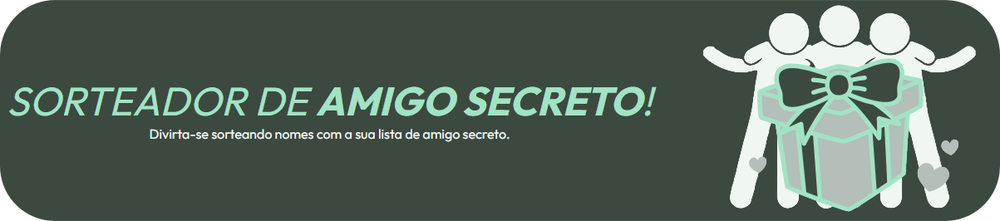
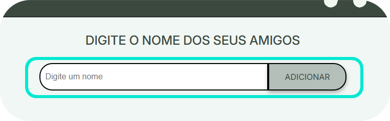
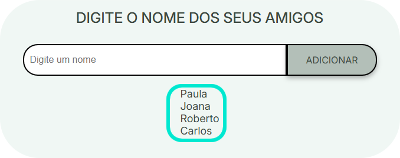
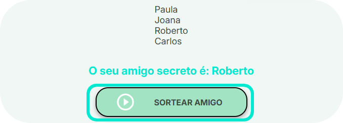

 # 
<strong>💥 Challenge Alura ONE </strong>

### 
Desafio de programação em JavaScript que faz parte da Formação Iniciante em Programação. 

## <strong>Indíce</strong>
- <a href="#linguagens"> Linguagens utilizadas. </a>
- <a href="#sobre"> Sobre o projeto. </a>
- <a href="#utilidade"> Qual sua utilidade? </a>
- <a href="#uso"> Como utilizar? </a>

## 
 <strong> Linguagens Utilizadas 💻</strong> 

 
  

✨ <strong>HTML5</strong> para marcação de toda a estrutura.

✨ <strong>JavaScript</strong> para toda a programação e suas funcionalidades.

✨ <strong>CSS3</strong> para toda a estilização da aplicação.

## 
 <strong> Sobre o Projeto 📑 </strong> 

O challenge proposto pela Alura em parceria com a ONE consiste em adicionar, através da linguagem de programação JavaScript, as funcionalidades necessárias para funcionar corretamente um Sorteador de Nome para Amigo Secreto. 

 O projeto já inclui toda a estrutura em HTML5 e CSS3 prontas para o foco ser totalmente voltado a programação, porém, optei por fazer algumas alterações visuais como: 

<ul> 
<li>Alterar imagem;</li>
<li>Alterar títulos; </li>
<li>Incluir subtítulo; </li>
<li>Alterar fontes;</li>
<li>Alterar cores.</li>
</ul>

## 
 <strong> Qual a Sua Utilidade? 🧐 </strong> 

 O sorteador de Amigo Secreto escolhe aleatóriamente um nome da lista que o usuário inclui e mostra na tela qual nome foi sorteado. 

 Pode ser utilizado em reuniões familiares, de amigos, eventos de finais de ano ou até mesmo eventos empresariais. 
 

## 
 <strong> Como Utilizar? 🤷🏽‍♀️</strong> 

Você pode acessar nossa aplicação através do Vercel clicando no link abaixo e utilizar de forma ilimitada com seus amigos!

 Para sortear corretamente, você precisar inserir os nomes um a um no campo "Digite um nome" e clicar no botão "Adicionar"

  

Logo após ter inserido toda sua lista de amigos,

  

 basta clicar no botão: "SORTEAR AMIGO" <strong>e o resultado aparecerá de forma instantânea!</strong

  

